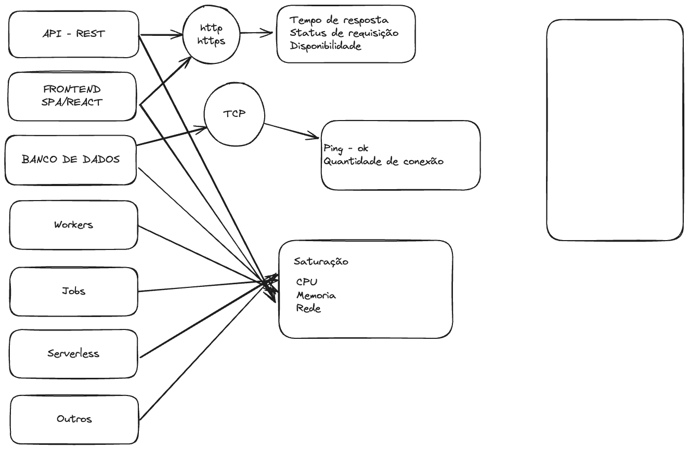
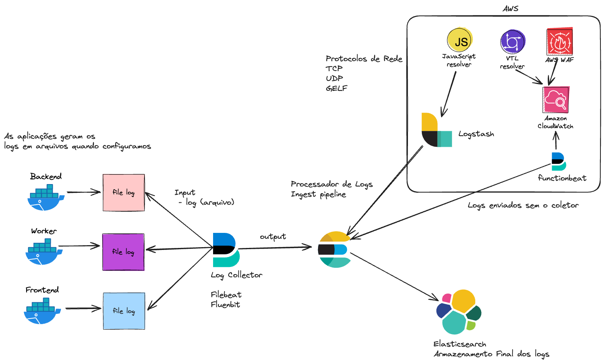

# Observability

### O que é Observabilidade?
Observabilidade é a capacidade de entender o comportamento interno de um sistema com base em suas saídas. Em outras palavras, é a capacidade de entender o que está acontecendo dentro de um sistema com base em suas saídas. 

### Por que é importante?

A observabilidade é importante porque permite que as equipes de operações e desenvolvimento entendam o comportamento interno de um sistema com base em suas saídas. Isso é importante porque permite que as equipes de operações e desenvolvimento entendam o comportamento interno de um sistema com base em suas saídas.


### Como podemos observar um sistema?

Podemos observar um sistema de várias maneiras, incluindo:

- Monitoramento
- Rastreamento
- Logs
- Métricas

### O que é monitoramento?

Monitoramento é a prática de observar um sistema para garantir que ele esteja funcionando corretamente. Isso pode incluir a verificação de métricas, logs e rastreamentos para garantir que o sistema esteja funcionando corretamente.

### O que é rastreamento(tracing)?

Rastreamento é a prática de observar o comportamento de um sistema ao longo do tempo. Isso pode incluir a observação de métricas, logs e rastreamentos para entender como o sistema está se comportando.

### O que são logs?

Logs são registros de eventos que ocorrem em um sistema. Eles podem ser usados para entender o comportamento de um sistema ao longo do tempo.

### O que são métricas?

Métricas são medidas quantitativas que podem ser usadas para entender o comportamento de um sistema. Elas podem incluir coisas como o tempo de resposta de um sistema, a taxa de erros e a utilização de recursos.

## Ferramentas de Observabilidade

### Prometheus


Prometheus é um sistema de monitoramento e alerta de código aberto. Ele coleta métricas de alvos configurados por meio de um modelo de coleta e armazenamento de séries temporais com um poderoso mecanismo de consulta.


**Documentações Importantes**

- [Instrumentação](https://prometheus.io/docs/instrumenting/clientlibs/)

- [Queries](https://prometheus.io/docs/prometheus/latest/querying/basics/)

- [Operadores](https://prometheus.io/docs/prometheus/latest/querying/operators/)

- [Funções](https://prometheus.io/docs/prometheus/latest/querying/functions/)

- [Grafana Exemplos](https://play.grafana.org/d/000000012/grafana-play-home?orgId=1)

- [Grafana Dashboards](https://grafana.com/grafana/dashboards/)

- [Loading Test Grafana k6](https://grafana.com/docs/k6/latest/get-started/installation/)


### Tipos de métricas
- Contadores
- Histogramas
- Sumários
- Temporais

#### Contadores
Contadores são métricas que representam um valor que pode aumentar ou diminuir ao longo do tempo. Eles são usados para medir coisas como o número de solicitações recebidas por um servidor ou o número de erros que ocorrem em um sistema.

#### Histogramas

Histogramas são métricas que representam a distribuição de valores em um conjunto de dados. Eles são usados para medir coisas como o tempo de resposta de um servidor ou a utilização de recursos de um sistema.

#### Sumários

Sumários são métricas que representam a distribuição de valores em um conjunto de dados. Eles são usados para medir coisas como o tempo de resposta de um servidor ou a utilização de recursos de um sistema.

#### Temporais

Métricas temporais são métricas que representam um valor que muda ao longo do tempo. Elas são usadas para medir coisas como o tempo de resposta de um servidor ou a utilização de recursos de um sistema.

### Tipos de alvos(Targets)

- Servidores
- Bancos de dados
- Aplicações
- Serviços

#### Servidores
Servidores são alvos que podem ser monitorados para garantir que estejam funcionando corretamente. Isso pode incluir a verificação de métricas, logs e rastreamentos para garantir que o servidor esteja funcionando corretamente.

#### Bancos de dados
Bancos de dados são alvos que podem ser monitorados para garantir que estejam funcionando corretamente. Isso pode incluir a verificação de métricas, logs e rastreamentos para garantir que o banco de dados esteja funcionando corretamente.

#### Aplicações

Aplicações são alvos que podem ser monitorados para garantir que estejam funcionando corretamente. Isso pode incluir a verificação de métricas, logs e rastreamentos para garantir que a aplicação esteja funcionando corretamente.

#### Serviços

Serviços são alvos que podem ser monitorados para garantir que estejam funcionando corretamente. Isso pode incluir a verificação de métricas, logs e rastreamentos para garantir que o serviço esteja funcionando corretamente.

### Tipos de alertas

- Alertas de limiar
- Alertas de anomalia
- Alertas de tendência
- Alertas de correlação

#### Alertas de limiar
Alertas de limiar são alertas que são acionados quando uma métrica ultrapassa um determinado limite. Eles são usados para alertar as equipes de operações e desenvolvimento sobre problemas em um sistema.

#### Alertas de anomalia
Alertas de anomalia são alertas que são acionados quando uma métrica se desvia significativamente de seu comportamento normal. Eles são usados para alertar as equipes de operações e desenvolvimento sobre problemas em um sistema.

#### Alertas de tendência
Alertas de tendência são alertas que são acionados quando uma métrica mostra uma tendência significativa ao longo do tempo. Eles são usados para alertar as equipes de operações e desenvolvimento sobre problemas em um sistema.

#### Alertas de correlação
Alertas de correlação são alertas que são acionados quando duas ou mais métricas mostram um comportamento correlacionado. Eles são usados para alertar as equipes de operações e desenvolvimento sobre problemas em um sistema.

### Tipos de consultas

- Consultas de agregação
- Consultas de filtro
- Consultas de projeção
- Consultas de transformação

#### Consultas de agregação
Consultas de agregação são consultas que são usadas para calcular estatísticas sobre um conjunto de dados. Elas são usadas para calcular coisas como a média, a mediana e o desvio padrão de um conjunto de dados.

#### Consultas de filtro
Consultas de filtro são consultas que são usadas para filtrar um conjunto de dados com base em um critério específico. Elas são usadas para filtrar coisas como solicitações de um determinado tipo ou erros de um determinado tipo.

#### Consultas de projeção

Consultas de projeção são consultas que são usadas para selecionar um subconjunto de colunas de um conjunto de dados. Elas são usadas para selecionar coisas como o tempo de resposta de um servidor ou a utilização de recursos de um sistema.

#### Consultas de transformação

Consultas de transformação são consultas que são usadas para transformar um conjunto de dados em um formato diferente. Elas são usadas para transformar coisas como o tempo de resposta de um servidor ou a utilização de recursos de um sistema.

### Tipos de visualizações

- Gráficos de linha
- Gráficos de barras
- Gráficos de pizza
- Gráficos de dispersão

#### Gráficos de linha

Gráficos de linha são gráficos que são usados para mostrar a mudança de uma métrica ao longo do tempo. Eles são usados para mostrar coisas como o tempo de resposta de um servidor ou a utilização de recursos de um sistema.

#### Gráficos de barras

Gráficos de barras são gráficos que são usados para mostrar a distribuição de uma métrica em um conjunto de dados. Eles são usados para mostrar coisas como o número de solicitações recebidas por um servidor ou o número de erros que ocorrem em um sistema.

#### Gráficos de pizza

Gráficos de pizza são gráficos que são usados para mostrar a distribuição de uma métrica em um conjunto de dados. Eles são usados para mostrar coisas como o número de solicitações recebidas por um servidor ou o número de erros que ocorrem em um sistema.

#### Gráficos de dispersão

Gráficos de dispersão são gráficos que são usados para mostrar a relação entre duas métricas em um conjunto de dados. Eles são usados para mostrar coisas como a relação entre o tempo de resposta de um servidor e a utilização de recursos de um sistema.

### Tipos de métricas

- Métricas de contagem
- Métricas de tempo
- Métricas de porcentagem
- Métricas de proporção


#### Métricas de contagem

Métricas de contagem são métricas que representam a contagem de algo. Elas são usadas para medir coisas como o número de solicitações recebidas por um servidor ou o número de erros que ocorrem em um sistema.

#### Métricas de tempo

Métricas de tempo são métricas que representam a duração de algo. Elas são usadas para medir coisas como o tempo de resposta de um servidor ou o tempo que um sistema leva para processar uma solicitação.

#### Métricas de porcentagem

Métricas de porcentagem são métricas que representam a proporção de algo em relação a um todo. Elas são usadas para medir coisas como a utilização de recursos de um sistema ou a taxa de erro de um sistema.

#### Métricas de proporção

Métricas de proporção são métricas que representam a relação entre duas métricas. Elas são usadas para medir coisas como a relação entre o tempo de resposta de um servidor e a utilização de recursos de um sistema.

## Quais métricas devo utilizar?

A escolha das métricas a serem utilizadas depende do tipo de aplicação que estamos monitorando. Abaixo, segue uma lista do que geralmente é monitorado em diferentes tipos de aplicações:

### API (Interface de Programação de Aplicações):
- REST (Transferência de Estado Representacional)
- SOAP (Protocolo Simples de Acesso a Objetos)
- GraphQL (Linguagem de Consulta e Manipulação de Dados)
- gRPC (Comunicação Remota Procedural)

### Serverless:
- AWS Lambda
- Google Cloud Functions
- Azure Functions

### Worker:
- Processamento de Tarefas em Segundo Plano
- Exemplos: Workers do Node.js, Threads em Java

### Jobs:
- Tarefas Agendadas
- Filas de Mensagens
- Exemplos: Cron Jobs, Azure WebJobs

### Software de Banco de Dados:
- MySQL
- PostgreSQL
- MongoDB
- Oracle
- SQL Server



Aqui está uma tabela mostrando o que geralmente precisa ser monitorado em ordem de importância para diferentes tipos de aplicações:

| Componente/Aspecto a ser Monitorado      | API            | Serverless     | Worker         | Jobs              |
|------------------------------------------|----------------|----------------|----------------|-------------------|
| Disponibilidade                          | Alta           | Alta           | Alta           | Alta              |
| Latência                                 | Baixa          | Baixa          | Baixa          | Baixa             |
| Taxa de Erros                            | Baixa          | Baixa          | Baixa          | Baixa             |
| Utilização de Recursos (CPU, Memória)    | Moderada       | Moderada       | Variável      | Moderada          |
| Número de Requisições                    | Moderado       | Moderado       | Baixo          | Baixo             |
| Tempo de Resposta das Requisições        | Baixo          | Baixo          | Moderado       | Moderado          |
| Taxa de Sucesso das Requisições          | Alta           | Alta           | Alta           | Alta              |
| Monitoramento de Segurança               | Sim            | Sim            | Sim            | Sim               |
| Escalabilidade                           | Importante     | Importante     | Menos Import. | Menos Importante  |
| Integrações Externas (Ex: APIs de Terceiros) | Importante | Moderado       | Moderado       | Moderado          |

Essas métricas e análises no Prometheus fornecem insights valiosos sobre o desempenho, a disponibilidade e o comportamento da API, permitindo uma monitoração eficaz e a identificação de possíveis problemas. As documentações de consulta fornecem detalhes adicionais sobre como utilizar as funções e expressões no Prometheus.

| Métrica                                | Descrição                                           | Cálculo/Análise no Prometheus                                 | Justificativa                                             | Documentação de Consulta                                            |
|----------------------------------------|-----------------------------------------------------|--------------------------------------------------------------|------------------------------------------------------------|----------------------------------------------------------------------|
| `api_requests_total`                   | Total de solicitações recebidas pela API           | `sum(rate(api_requests_total[5m]))`                         | Monitorar o volume total de tráfego na API                | [Rate Function](https://prometheus.io/docs/prometheus/latest/querying/functions/#rate) |
| `api_request_duration_seconds`         | Duração das solicitações                           | `histogram_quantile(0.95, sum(rate(api_request_duration_seconds_bucket[5m])) / sum(rate(api_request_duration_seconds_count[5m])))` | Identificar o tempo médio de resposta das solicitações | [Histograms and Summaries](https://prometheus.io/docs/practices/histograms/) |
| `api_requests_by_method_total`        | Número de solicitações por tipo de método HTTP    | `sum by (method) (rate(api_requests_by_method_total[5m]))`  | Verificar a distribuição de solicitações por método HTTP | [Grouping by](https://prometheus.io/docs/prometheus/latest/querying/examples/#grouping-by) |
| `api_response_size_bytes`              | Tamanho das respostas enviadas pela API           | `avg(api_response_size_bytes)`                             | Monitorar o tamanho médio das respostas                  | [Averaging Functions](https://prometheus.io/docs/prometheus/latest/querying/functions/#averaging-function) |
| `api_request_errors_total`            | Número de erros de solicitação                    | `sum(rate(api_request_errors_total[5m]))`                   | Identificar a taxa de erro de solicitação                | [Rate Function](https://prometheus.io/docs/prometheus/latest/querying/functions/#rate) |
| `api_request_duration_seconds{endpoint="meu_endpoint"}` | Tempo de resposta por endpoint específico | `histogram_quantile(0.95, sum(rate(api_request_duration_seconds_bucket{endpoint="meu_endpoint"}[5m])) / sum(rate(api_request_duration_seconds_count{endpoint="meu_endpoint"}[5m])))` | Avaliar o tempo médio de resposta para endpoints específicos | [Histograms and Summaries](https://prometheus.io/docs/practices/histograms/) |


## Histogramas e Percentis:

Um histograma é uma estrutura de dados estatística que organiza e resume a distribuição de valores de uma métrica em intervalos (buckets) fixos. Em Prometheus, os histogramas são comumente usados para medir a distribuição dos tempos de resposta de solicitações HTTP, por exemplo.

Percentil é uma medida estatística que indica o valor abaixo do qual um percentual específico de observações em um grupo cai. Por exemplo, o percentil 95 (abreviado como P95) indica o valor abaixo do qual 95% dos dados em um conjunto de dados cai.

## Função `histogram_quantile()`:

A função `histogram_quantile()` do Prometheus é usada para calcular os percentis de um histograma. A fórmula para calcular o percentil é um pouco complexa, mas pode ser compreendida da seguinte maneira:

1. **Coleta de Dados**: O Prometheus coleta dados de histograma em dois vetores: o vetor de contagens e o vetor de somas.
   - O vetor de contagens (`_bucket`) contém o número de observações em cada intervalo (bucket) do histograma.
   - O vetor de somas (`_sum`) contém a soma total dos valores observados em cada intervalo.

2. **Calculando o Quantil**: A função `histogram_quantile()` utiliza esses dados para calcular o valor do percentil desejado.
   - Primeiro, a função calcula a soma cumulativa das contagens de cada intervalo até o percentil desejado.
   - Em seguida, ele encontra o intervalo onde a soma cumulativa ultrapassa o percentil desejado.
   - Por fim, ele interpola linearmente entre os limites desse intervalo para calcular o valor do percentil.


## Vetores no Prometheus

No contexto do Prometheus, os "vetores" referem-se a conjuntos de séries temporais que representam dados coletados de métricas ao longo do tempo. Existem dois tipos principais de vetores usados no Prometheus: vetores instantâneos e vetores de intervalo.

1. **Vetores Instantâneos**: Vetores instantâneos representam uma única amostra para cada série temporal em um momento específico no tempo. Eles são úteis para consultar o valor atual de uma métrica em um determinado ponto no tempo. Por exemplo, `cpu_usage{instance="example.com"}` é um vetor instantâneo que representa a utilização atual da CPU em um determinado servidor.

> Imagine que temos um amigo chamado Alex, que é dono de uma loja online. Alex quer monitorar quantas pessoas estão visitando sua loja a cada minuto. Então, a cada minuto, ele olha para o número de visitantes e anota esse número. Esses números são como os "instantâneos" que nos mostram quantos visitantes estavam na loja naquele momento específico.

2. **Vetores de Intervalo**: Vetores de intervalo representam uma série de amostras para cada série temporal dentro de um intervalo de tempo específico. Eles são usados para consultas que envolvem uma janela de tempo, como calcular médias ou taxas de mudança ao longo do tempo. Por exemplo, `rate(http_requests_total[5m])` é um vetor de intervalo que representa a taxa de solicitações HTTP por segundo nos últimos 5 minutos.

> Agora, Alex quer entender como o número de visitantes mudou ao longo do dia. Ele olha para o número de visitantes a cada hora e anota esses números. Depois, ele junta esses números para ver como o número de visitantes mudou ao longo do dia. Esses são como os "vetores de intervalo" que nos mostram como o número de visitantes mudou ao longo do tempo.

A consulta para obter os instantâneos do número de visitantes a cada minuto seria algo assim:
```promsql
rate(visitors_online[1m])
```
Esta consulta calcula a taxa de alteração da métrica `visitors_online` ao longo do tempo, considerando uma janela de 1 minuto. Isso nos dará um instantâneo do número de visitantes por minuto.

Para tornar a consulta mais realista, podemos usar uma função de agregação, como `sum()` ou `avg()`, para agregar os dados de diferentes instâncias ou réplicas da loja online, se aplicável. Por exemplo:

```promsql
sum(rate(visitors_online[1m])) by (instance)
```
Esta consulta calcula a taxa de alteração da métrica `visitors_online` ao longo do tempo para cada instância da loja online e, em seguida, soma os resultados.

> Assim, o resultado desta consulta nos fornecerá uma série temporal com os instantâneos do número de visitantes da loja online a cada minuto, permitindo-nos entender melhor o fluxo de visitantes ao longo do tempo.

Supondo que você queira recuperar o número absoluto de visitantes da loja online a cada minuto, você pode usar a função `sum()` para agregar os valores instantâneos da métrica `visitors_online` dentro de cada intervalo de tempo. Aqui está a consulta:

```promsql
sum(visitors_online) by (time)
```
Esta consulta somará todos os valores instantâneos da métrica `visitors_online` para cada intervalo de tempo (cada ponto de dados), fornecendo o número absoluto de visitantes em cada minuto.


Além disso, o Prometheus também coleta dados de histograma em vetores especiais conhecidos como vetores de histograma. Esses vetores são usados para métricas que estão agrupadas em intervalos (buckets) com base em valores específicos. Por exemplo, um vetor de histograma pode representar o número de solicitações HTTP que caíram em intervalos de tempo de resposta específicos.

Em resumo, os vetores no Prometheus são conjuntos de séries temporais que representam dados de métricas ao longo do tempo. Eles são fundamentais para consultas e análises de dados no Prometheus, permitindo monitoramento eficaz e visualização de métricas em sistemas e aplicações.

Assim como o Alex usa esses "vetores" para entender o comportamento dos visitantes de sua loja ao longo do tempo, nós usamos esses vetores mágicos no monitoramento de uma API REST para entender como ela está sendo usada, como seu desempenho está mudando e se há algum problema acontecendo.


## Quantil no Prometheus

Suponha que temos um histograma que mede o tempo de resposta das solicitações HTTP. Queremos calcular o tempo médio de resposta no percentil 95. Podemos usar a função `histogram_quantile(0.95, sum(rate(http_request_duration_seconds_bucket[5m])))` para calcular isso.

Essa expressão calcula o tempo médio de resposta no percentil 95 nos últimos 5 minutos usando os dados coletados dos buckets de duração das solicitações HTTP.

Em resumo, a função `histogram_quantile()` do Prometheus é essencial para calcular percentis em histogramas e entender a distribuição dos dados. Ele nos permite obter insights valiosos sobre o desempenho de nossas aplicações e sistemas.

### Exemplo de uso para uma API

Ao calcular o tempo de resposta de uma API usando percentis, geralmente se coletam os tempos de resposta de cada solicitação feita à API ao longo do tempo. Esses tempos de resposta são organizados em uma série temporal e ordenados em ordem crescente.

Depois de coletar esses tempos de resposta, podemos usar percentis para entender melhor o desempenho da API. Por exemplo:

-   **Percentil 50 (p50)**: Este é o valor onde 50% das respostas foram mais rápidas e 50% foram mais lentas. É uma medida da tendência central dos tempos de resposta da API.
```promsql
histogram_quantile(0.50, sum(rate(api_request_duration_seconds_bucket[5m])) by (le))
```
> Esta consulta calcula o percentil 50 (p50) do tempo de resposta das solicitações da API nos últimos 5 minutos. Ele usa a métrica `api_request_duration_seconds_bucket` que contém os tempos de resposta agrupados em intervalos (buckets) e `rate()` para calcular a taxa de alteração ao longo do tempo.
    
-   **Percentil 95 (p95)**: Este é o valor onde 95% das respostas foram mais rápidas e apenas 5% foram mais lentas. Isso nos dá uma ideia do desempenho típico da API na maioria dos casos, excluindo os casos extremos.

```promsql
histogram_quantile(0.50, sum(rate(api_request_duration_seconds_bucket[5m])) by (le))
```
> Esta consulta calcula o percentil 95 (p95) do tempo de resposta das solicitações da API nos últimos 5 minutos.

-   **Percentil 99 (p99)**: Este é o valor onde 99% das respostas foram mais rápidas e apenas 1% foram mais lentas. Ele nos dá uma ideia do desempenho extremo da API em situações raras ou de pico.

```promsql
histogram_quantile(0.50, sum(rate(api_request_duration_seconds_bucket[5m])) by (le))
```    
>   Esta consulta calcula o percentil 99 (p99) do tempo de resposta das solicitações da API nos últimos 5 minutos.
Essas consultas usam a função `histogram_quantile()` para calcular os valores dos percentis 50, 95 e 99 com base nos dados de tempo de resposta armazenados em um histograma. Esses percentis são úteis para entender a distribuição dos tempos de resposta da API e identificar os casos extremos ou típicos de desempenho.
Vamos dar um exemplo para ilustrar:

Suponha que coletamos os tempos de resposta de uma API durante uma hora. Após organizar esses tempos de resposta em ordem crescente, podemos calcular os percentis:

-   **p50**: 100 ms
-   **p95**: 500 ms
-   **p99**: 2000 ms

Isso significa que:

-   Metade das solicitações (p50) foram respondidas em 100 ms ou menos.
-   95% das solicitações (p95) foram respondidas em 500 ms ou menos.
-   99% das solicitações (p99) foram respondidas em 2000 ms ou menos.

Esses percentis nos ajudam a entender o desempenho da API em diferentes situações e a identificar possíveis gargalos ou problemas de desempenho. Eles são uma ferramenta valiosa para avaliar a qualidade e a eficiência de uma API em ambientes de produção.

## O que são **LOGS** e como funcionam?

Os logs são registros de eventos ou atividades que ocorrem em um sistema, como uma aplicação ou infraestrutura. Eles fornecem uma maneira de acompanhar o que está acontecendo, permitindo a detecção de problemas, monitoramento de desempenho e investigação de incidentes. Aqui está uma visão geral simples de como funciona o processo de coleta, exposição e formatação dos logs até o processamento e indexação:

### Logs de Aplicativos:

1. **Coleta**: Quando um aplicativo é executado, ele gera logs para registrar eventos relevantes, como erros, avisos ou informações sobre atividades do usuário.
   
2. **Exposição**: Os logs são geralmente escritos em arquivos de texto simples, onde podem ser facilmente acessados pela equipe de desenvolvimento ou operações.

3. **Formatação**: Os logs são formatados de forma estruturada ou não estruturada, dependendo das necessidades da aplicação. Isso pode incluir informações como timestamp, tipo de evento e detalhes adicionais.

### Logs de Infraestrutura:

1. **Coleta**: Os dispositivos de infraestrutura, como servidores, roteadores e switches, também geram logs para registrar eventos importantes, como falhas de hardware, congestionamento de rede ou problemas de segurança.

2. **Exposição**: Assim como os logs de aplicativos, os logs de infraestrutura são geralmente armazenados em arquivos de texto simples ou podem ser enviados para um servidor centralizado para processamento adicional.

3. **Formatação**: Os logs de infraestrutura podem conter informações específicas sobre o dispositivo, como endereço IP, nome do host e status do sistema.

### Logs de Segurança:

1. **Coleta**: Os logs de segurança registram atividades relacionadas à segurança, como tentativas de login falhadas, acessos não autorizados ou atividades suspeitas.

2. **Exposição**: Eles são geralmente armazenados de forma segura e acessados apenas por equipes de segurança autorizadas.

3. **Formatação**: Os logs de segurança podem incluir informações detalhadas sobre o evento, como o endereço IP do usuário, o tipo de atividade e o resultado da ação.

### Logs de Auditoria:

1. **Coleta**: Os logs de auditoria registram eventos relacionados à conformidade regulatória, políticas internas ou auditorias externas.

2. **Exposição**: Eles são mantidos de forma segura e podem ser acessados por equipes de auditoria ou conformidade.

3. **Formatação**: Os logs de auditoria geralmente incluem informações detalhadas sobre as ações realizadas, os usuários envolvidos e o resultado da auditoria.

## Processamento e Indexação

Depois que os logs são coletados, eles podem ser processados e indexados para facilitar a pesquisa, análise e visualização. Isso geralmente envolve o uso de ferramentas de análise de logs, como Elasticsearch, Logstash e Kibana (ELK Stack), que permitem pesquisar e analisar grandes volumes de logs de forma eficiente.


Em resumo, os logs são uma parte fundamental da observabilidade de sistemas, fornecendo insights valiosos sobre o funcionamento e o desempenho de uma aplicação, infraestrutura, segurança e conformidade. Entender como os logs são coletados, expostos, formatados, processados e indexados é essencial para garantir uma operação eficiente e segura dos sistemas de TI.

## Coleta de Logs

Existem várias maneiras de coletar logs de sistemas e aplicativos. Abaixo estão algumas das formas mais comuns:

#### 1. **Logging Local em Arquivos**

-   **Descrição**: Os logs são gravados diretamente em arquivos de texto locais no sistema onde a aplicação está sendo executada.
-   **Método de Coleta**: Os logs são escritos em arquivos de log configurados localmente pela aplicação.
-   **Vantagens**: Simples de configurar e implementar, baixo overhead de rede.
-   **Desvantagens**: Difícil de gerenciar em escala, não centralizado, difícil de monitorar em tempo real.

#### 2. **Centralização de Logs com Agentes**

-   **Descrição**: Um agente de coleta é instalado em cada servidor ou máquina e é responsável por enviar os logs para um local centralizado.
-   **Método de Coleta**: O agente coleta os logs localmente e os envia para um servidor central.
-   **Vantagens**: Centralizado para fácil gerenciamento, possibilita a correlação de logs entre vários sistemas.
-   **Desvantagens**: Requer configuração e gerenciamento dos agentes, potencial para overhead de rede.

#### 3. **Coleta de Logs via API ou Protocolos Remotos**

-   **Descrição**: Os logs são enviados diretamente para um serviço de coleta de logs via API ou protocolos remotos.
-   **Método de Coleta**: As aplicações enviam os logs diretamente para um serviço de coleta de logs usando APIs ou protocolos como Syslog, Fluentd, ou Logstash.
-   **Vantagens**: Elimina a necessidade de instalar e gerenciar agentes, escalável para ambientes em nuvem e distribuídos.
-   **Desvantagens**: Pode exigir modificações nas aplicações para suportar a coleta via API, potencial para overhead de rede dependendo da implementação.

## Como escolher a melhor opção de coleta de logs?

A escolha da melhor opção de coleta de logs depende dos requisitos específicos do seu ambiente, incluindo o tamanho e a complexidade da infraestrutura, o volume de logs gerados e os recursos disponíveis para gerenciar a coleta de logs.

-   Para ambientes menores e menos complexos, a coleta local em arquivos pode ser suficiente e fácil de implementar.
-   Para ambientes maiores e mais distribuídos, a centralização de logs com agentes ou a coleta via API pode ser mais escalável e fácil de gerenciar em longo prazo.

Em geral, é importante considerar fatores como escalabilidade, facilidade de gerenciamento, overhead de rede e integração com ferramentas de análise de logs ao escolher a melhor opção de coleta de logs para o seu ambiente.

### Lista dos principais coletores

| Coletores de Logs | Descrição | Documentação | Exemplos de Casos de Uso |
|-------------------|-----------|--------------|--------------------------|
| **1. Fluentd** | Coletor de logs unificado que permite coletar, filtrar e encaminhar logs para vários destinos. | [Documentação](https://docs.fluentd.org/) | Integração com Kubernetes, coleta de logs de aplicativos e infraestrutura. |
| **2. Logstash** | Pipeline de processamento de dados que coleta, transforma e envia logs para destinos como Elasticsearch ou outros sistemas. | [Documentação](https://www.elastic.co/guide/en/logstash/current/index.html) | Centralização de logs, análise de segurança e monitoramento de infraestrutura. |
| **3. rsyslog** | Servidor de logs robusto e altamente configurável, que suporta uma variedade de formatos de logs e protocolos de envio. | [Documentação](https://www.rsyslog.com/doc/) | Coleta de logs do sistema, logs de segurança e auditoria. |
| **4. Graylog** | Plataforma de gerenciamento de logs e eventos que coleta, processa e armazena logs de várias fontes para análise e visualização. | [Documentação](https://docs.graylog.org/) | Monitoramento de segurança, análise de desempenho de aplicativos e registros de auditoria. |
| **5. Fluent Bit** | Coletor de logs leve e rápido, projetado para coletar e enviar logs para sistemas de agregação, como Fluentd, Elasticsearch e outros. | [Documentação](https://docs.fluentbit.io/) | Coleta de logs de contêineres, monitoramento de Kubernetes e integração com plataformas de nuvem. |
| **6. NXLog** | Coletor de logs multiplataforma que suporta vários formatos de logs e protocolos de envio, adequado para ambientes Windows e Linux. | [Documentação](https://nxlog.co/documentation/nxlog-user-guide.pdf) | Monitoramento de logs do sistema, segurança de rede e análise forense. |
| **7. Apache Flume** | Ferramenta de ingestão de dados distribuída que pode coletar, agregar e mover grandes volumes de dados de log para sistemas de armazenamento centralizado. | [Documentação](https://flume.apache.org/FlumeUserGuide.html) | Ingestão de logs de aplicativos web, análise de tráfego e monitoramento de servidores. |
| **8. Beats (Filebeat, Metricbeat, etc.)** | Coleção de agentes leves de envio de dados, desenvolvidos pela Elastic, que coletam e enviam logs, métricas e outros dados para Elasticsearch. | [Documentação](https://www.elastic.co/guide/en/beats/libbeat/current/index.html) | Monitoramento de contêineres, coleta de métricas de infraestrutura e logs de segurança. |
| **9. Syslog-ng** | Implementação avançada do protocolo syslog que oferece recursos de filtragem, encaminhamento e processamento de logs em tempo real. | [Documentação](https://www.syslog-ng.com/technical-documents/) | Coleta de logs do sistema, logs de firewall e monitoramento de eventos de segurança. |
| **10. Logagent** | Coletor de logs leve e rápido, com suporte a plugins, que permite coletar, enriquecer e enviar logs para várias saídas. | [Documentação](https://sematext.com/docs/logagent/) | Coleta de logs de aplicativos, monitoramento de contêineres e integração com sistemas de monitoramento. |

## Exposição de logs
A exposição de logs é uma prática importante em desenvolvimento de software e administração de sistemas, pois permite monitorar e analisar o comportamento de um sistema, identificar problemas e tomar decisões informadas sobre manutenção e otimização. Abaixo estão algumas aplicações comuns para a exposição de logs, juntamente com uma lista em formato Markdown:

### Aplicações para Exposição de Logs:

1.  **Monitoramento de Aplicações em Tempo Real**: Exibir logs em tempo real ajuda a identificar problemas imediatos, como erros de aplicação, falhas de conexão ou atividades suspeitas.
    
2.  **Depuração de Código**: Logs detalhados podem ajudar os desenvolvedores a identificar e corrigir bugs no código. A exposição de logs pode fornecer insights sobre o fluxo de execução e o estado das variáveis durante a execução do programa.
    
3.  **Análise de Desempenho**: Monitorar logs de desempenho permite identificar gargalos de desempenho, tempos de resposta lentos e áreas do sistema que podem ser otimizadas.
    
4.  **Segurança da Informação**: A exposição de logs é crucial para detectar atividades maliciosas, como tentativas de invasão, acesso não autorizado ou comportamento suspeito em sistemas de segurança.
    
5.  **Auditoria e Conformidade**: Logs detalhados são frequentemente necessários para fins de auditoria e conformidade com regulamentações, como HIPAA (Health Insurance Portability and Accountability Act) ou GDPR (General Data Protection Regulation).
    
6.  **Resolução de Problemas de Produção**: Quando ocorrem problemas em ambientes de produção, os logs podem ajudar a diagnosticar e resolver rapidamente os problemas, minimizando o tempo de inatividade do sistema.
    
7.  **Análise de Tendências e Padrões**: Analisar logs ao longo do tempo pode revelar tendências e padrões de uso do sistema, ajudando a planejar futuras atualizações e melhorias.

### Formato de logs
| Formato de Log | Descrição | Link de Referência |
|----------------|-----------|--------------------|
| Syslog | Formato de log padrão usado principalmente em sistemas Unix e Linux. Os logs geralmente são texto simples com uma estrutura definida. | [RFC 5424 - Syslog Protocol](https://tools.ietf.org/html/rfc5424) |
| JSON | Formato de log estruturado no formato JSON (JavaScript Object Notation). Permite uma análise mais fácil dos logs e integração com ferramentas de análise de logs. | [Introdução ao JSON](https://www.json.org/json-en.html) |
| CSV (Comma-Separated Values) | Formato de log no qual os valores são separados por vírgulas. É frequentemente usado para registros tabulares simples e é fácil de ser lido e manipulado por ferramentas de planilhas e bancos de dados. | [Wikipedia - CSV](https://en.wikipedia.org/wiki/Comma-separated_values) |
| Apache Log Format | Formato de log usado pelo servidor web Apache. Os logs seguem um formato padronizado que inclui informações sobre solicitações HTTP, como endereço IP, URL solicitada e código de status HTTP. | [Apache Log Files](https://httpd.apache.org/docs/2.4/logs.html) |
| Common Log Format (CLF) | Uma variante do formato de log do Apache que segue uma estrutura comum para logs de servidores web. Contém informações básicas sobre solicitações HTTP, como método, URL e código de status. | [Common Log Format](https://httpd.apache.org/docs/2.4/logs.html#common) |
| W3C Extended Log Format | Outra variante do formato de log do Apache que fornece mais detalhes sobre solicitações HTTP, como referenciador, agente do usuário e tempo de resposta do servidor. | [W3C Extended Log File Format](https://www.w3.org/TR/WD-logfile.html) |
| ECS (Elastic Common Schema) | Um conjunto de campos padronizados e uma estrutura de dados para logs e eventos. Foi projetado para facilitar a integração, análise e visualização de logs em uma variedade de ferramentas e plataformas. | [Elastic Common Schema](https://www.elastic.co/guide/en/ecs/current/index.html) |

### Protocolos
| Protocolo | Descrição | Portas Usadas | Link de Referência |
|-----------|-----------|---------------|--------------------|
| Syslog | Protocolo padrão para envio de mensagens de log em redes IP. Permite a coleta centralizada de logs de vários dispositivos e aplicativos. | UDP: 514 | [RFC 5424 - Syslog Protocol](https://tools.ietf.org/html/rfc5424) |
| SNMP (Simple Network Management Protocol) | Protocolo usado para gerenciamento e monitoramento de dispositivos de rede. Pode ser usado para coletar informações de status e logs de dispositivos de rede. | UDP: 161 | [RFC 1157 - SNMP](https://tools.ietf.org/html/rfc1157) |
| SNMP Trap | Uma forma de notificação assíncrona usada para informar a uma estação de gerenciamento de rede sobre eventos de interesse. Pode ser usado para enviar logs e alertas de dispositivos de rede. | UDP: 162 | [RFC 1157 - SNMP](https://tools.ietf.org/html/rfc1157) |
| Logstash Forwarder (Beats) | Protocolo usado pelo Logstash Forwarder (também conhecido como Beats) para enviar logs de clientes para o Logstash para processamento. Pode ser usado em combinação com o ELK Stack (Elasticsearch, Logstash, Kibana). | TCP: 5044 | [Beats Protocol](https://www.elastic.co/guide/en/beats/libbeat/7.17/beats-reference-protocol.html) |
| HTTP/S | Protocolo de transferência de hipertexto usado para comunicação entre clientes e servidores web. Pode ser usado para enviar logs para servidores remotos ou serviços de armazenamento em nuvem. | TCP: 80, 443 | [RFC 7230 - HTTP/1.1](https://tools.ietf.org/html/rfc7230) |
| TCP/UDP | Protocolos de transporte usados para comunicação de rede. Podem ser usados para enviar logs entre dispositivos em uma rede local ou pela Internet. | TCP: 0-65535, UDP: 0-65535 | [RFC 793 - TCP](https://tools.ietf.org/html/rfc793), [RFC 768 - UDP](https://tools.ietf.org/html/rfc768) |
| AMQP (Advanced Message Queuing Protocol) | Protocolo de mensagens assíncronas usado para troca de mensagens entre aplicativos. Pode ser usado para enviar logs entre componentes de sistemas distribuídos. | TCP: 5672 | [AMQP Specification](https://www.amqp.org/resources/specifications) |
| GELF (Graylog Extended Log Format) | Formato de log usado pelo Graylog para envio de logs estruturados. É baseado em JSON e suporta compressão e transferência eficiente de logs. | UDP: 12201 | [Graylog GELF Specification](https://docs.graylog.org/en/latest/pages/gelf.html) |

## Simples diagrama ELK
